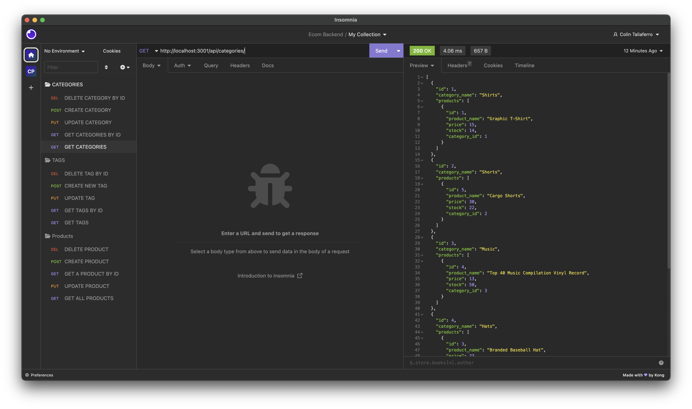

# Ecommerce Backend

  

## Table-of-Contents

* [Description](#description)
* [Installation](#installation)
* [Usage](#usage)
* [License](#license)
* [Contributing](#contributing)
* [Tests](#tests)
* [Questions](#questions)

## [Description](#table-of-contents)

  This project utilizes node, dotenv, sequelize, and insomnia to provide a CLI Ecommerce tool that allows you to see, create, update,and delete categories, products, and tags.

## [Installation](#table-of-contents)

  To install this application, clone the repository's code, run npm install in the terminal, sequelize a database, run npm run seed in the terminal, and the run node server.js.

## [Usage](#table-of-contents)

  Using insomnia, use GET, POST, DELETE, and PUT routes to change products, categories, or tags.

  The following image shows what the application should look like in insomnia: 

## [Contributing](#table-of-contents)

    Thank you for your interest contributing; however, right now, I will not be accepting outside contributions.

## [Questions](#table-of-contents)

  Please contact me using the following links:

  [GitHub](https://github.com/colint771)

  [Email: colint771@gmail.com](mailto:colint771@gmail.com)
